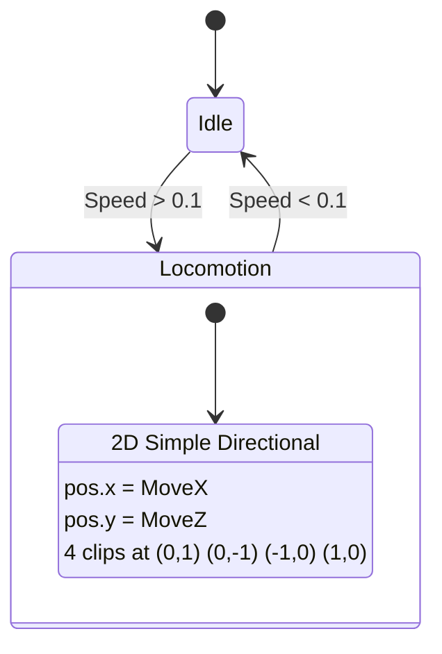
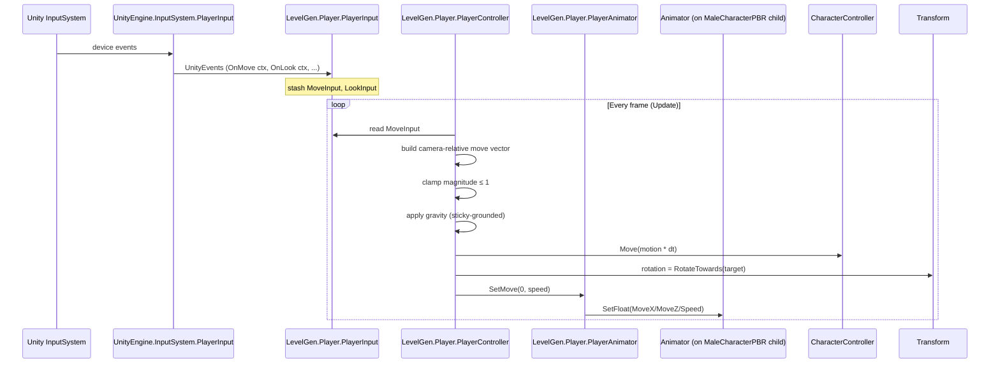

# Player Animator + Scripts Design — Milestone 1 — 2026-04-26

Spec for the Player Animator base controller, override controller, and the
four `LevelGen.Player` scripts. **Design only.** No assets created, no code
written. Prompts 03 and 04 implement against this document.

Source-of-truth references:
- [CLAUDE.md](../CLAUDE.md) — project canon
- [Player_Asset_Inventory_2026-04-26.md](Player_Asset_Inventory_2026-04-26.md) — clip GUIDs, bone paths, prefab defaults
- [InputSystem_Actions.inputactions](../Assets/InputSystem_Actions.inputactions) — Player + UI maps verified

---

## Executive summary

- **Ships in milestone 1:** Player prefab spawns with Idle pose; gamepad-stick
  / WASD drives camera-relative walk with body-rotates-to-face-move-direction;
  releasing input returns to Idle within ~0.15 s; `CharacterController` is the
  single source of position truth (no root motion).
- **Animator design:** one base controller `PlayerBaseController.controller`
  + one override `PlayerOverride_MaleHero.overrideController`. Two states
  (`Idle`, `Locomotion`), three Float parameters (`MoveX`, `MoveZ`, `Speed`),
  one 2D Simple-Directional blend tree wired to all four `_InPlace` Battle
  walks even though M1 only ever exercises the (0,+1) corner.
- **Scripts:** four scripts in `LevelGen.Player`, single-direction dependency
  chain `PlayerInput → PlayerController → PlayerAnimator → Animator`. No
  cross-talk, no V1-style "everyone writes everywhere".
- **Input:** Unity's `PlayerInput` MonoBehaviour with `Invoke Unity Events`
  Behavior. All 9 Player actions stub-wired; only `Move` and `Look` carry
  state in M1.
- **Locomotion model:** rotate-to-face → blend tree only ever sees `MoveX=0`,
  `MoveZ=Speed`. The remaining BWD/LFT/RGT corners stay authored, dormant,
  ready for a M2 strafe-mode that swaps in.
- **Explicitly NOT in M1:** sprint, jump, attack, crouch, interact, camera
  follow, death/hit reactions, multi-character variants, weapon attach.

---

## 1. Behavior table

### 1a. State table

| State name | Clip | GUID | Looping | State speed | Notes |
|---|---|---|---|---|---|
| **Idle** | `Idle_Battle_SwordAndShield` (sub-asset of `Idle_Battle_SwordAndShiled.fbx`) | `0308cf4e83cf517488b60af58b290fe0` | yes (`loopTime: 1`) | `1.0` | Default state. 20 frames. |
| **Locomotion** | *blend tree — see §1b* | n/a | n/a | `1.0` (M1 fixed; M2 may bind to `Speed`) | Contains 2D Simple Directional blend over four `_InPlace_Battle` clips. |

### 1b. Locomotion blend tree

**Type:** `2D Simple Directional`. Justification: the four authored clips sit
exactly on cardinal compass points; magnitude does not need to influence
blend weights (state speed handles cycle rate); Simple Directional is the
fastest of the three 2D modes and the only one that does not need a center
node.

**Position parameters:** `pos.x = MoveX`, `pos.y = MoveZ`. Standard Unity
convention — Animator's "Y" axis on a 2D blend tree corresponds to
forward/back, not world-up.

| pos.x | pos.y | Clip | GUID | Direction |
|---:|---:|---|---|---|
| 0  |  1 | `MoveFWD_Battle_InPlace_SwordAndShield` | `7d4f9e9da55a3bd4f958a63308a522a1` | forward |
| 0  | -1 | `MoveBWD_Battle_InPlace_SwordAndShield` | `4897d9e1e93439744a78d1cebdef17ff` | backward |
| -1 |  0 | `MoveLFT_Battle_InPlace_SwordAndShield` | `048a541568c52514c9996fea7b37d6e0` | strafe left |
|  1 |  0 | `MoveRGT_Battle_InPlace_SwordAndShield` | `f531fd2d5a6a8a440b5d450e029c4041` | strafe right |

No center (0,0) node — the `Speed`-gated transition out of Locomotion fires
before the blend tree ever needs to evaluate at the origin. (Simple
Directional doesn't require a center node.)

All four clips are uniform 16 frames @ assumed 30 fps source ≈ 0.533 s
cycle, so no per-clip speed normalization is needed.

### 1c. Parameter table

| Name | Type | Default | Set by | Range | Purpose |
|---|---|---:|---|---|---|
| `MoveX` | Float | `0` | `PlayerAnimator.SetMove(...)` | `[-1, 1]` | Body-local strafe axis. M1 always 0 (rotate-to-face). |
| `MoveZ` | Float | `0` | `PlayerAnimator.SetMove(...)` | `[-1, 1]` | Body-local forward axis. M1 = `Speed` when moving. |
| `Speed` | Float | `0` | `PlayerAnimator.SetMove(...)` | `[0, 1]` | `sqrt(MoveX² + MoveZ²)`, clamped to 1. Used by transition gating. |

**Speed clamping:** WASD diagonal raw input gives magnitude √2 ≈ 1.414.
`PlayerController` clamps the input vector's magnitude to ≤ 1 before
passing to `PlayerAnimator`, so `Speed ∈ [0, 1]` strictly. (Open Q-5.)

### 1d. Transition table

| From | To | Condition | Has Exit Time | Duration | Interruption Source | Notes |
|---|---|---|---|---:|---|---|
| `Idle` | `Locomotion` | `Speed > 0.1` | **no** | `0.15 s` (fixed) | None | Stick-drift deadzone at 0.1. |
| `Locomotion` | `Idle` | `Speed < 0.1` | **no** | `0.15 s` (fixed) | None | Same threshold (no hysteresis needed — `Speed` is continuous). |

**No `Any State` transitions in M1.** Death/hit/stagger reactions in later
milestones will introduce them; keeping the graph flat now makes M1 trivial
to debug.

**Transition Fixed Duration:** `true` (so 0.15 s stays 0.15 s regardless of
clip cycle length). Standard for parameter-gated transitions.

---

## 2. State graph



---

## 3. Script API designs

All four scripts under `namespace LevelGen.Player`, in
`Assets/Scripts/Player/`. No new editor scripts in M1 (`Editor/` folder
exists for future use).

### 3a. `PlayerInput.cs`

**Path:** `Assets/Scripts/Player/PlayerInput.cs`

**Responsibility.** Read the InputSystem and expose the current frame's
intent as plain-data properties to other scripts. Owns *no* movement
logic, *no* animator logic, *no* transform writes. UnityEvent endpoints
declared for every Player-map action so the prefab inspector binds without
warnings, but only `Move` and `Look` carry state in M1; the rest are
trace-log stubs awaiting later milestones.

> **Naming collision note.** `UnityEngine.InputSystem.PlayerInput` is the
> Unity-shipped MonoBehaviour we attach to the prefab. Our class is
> `LevelGen.Player.PlayerInput`. The two never clash inside our `.cs`
> because we never reference Unity's `PlayerInput` by name — we receive
> callbacks via `InputAction.CallbackContext` parameters wired in the
> inspector. Open Q-4 covers whether to rename ours to avoid the
> human-confusion risk.

```csharp
namespace LevelGen.Player
{
    public class PlayerInput : MonoBehaviour
    {
        // ── Public read API ──────────────────────────────────────
        public Vector2 MoveInput { get; private set; }
        public Vector2 LookInput { get; private set; }

        // ── UnityEvent endpoints (Behavior: Invoke Unity Events) ─
        public void OnMove(InputAction.CallbackContext ctx);
        public void OnLook(InputAction.CallbackContext ctx);
        public void OnAttack(InputAction.CallbackContext ctx);    // M1 stub: log
        public void OnInteract(InputAction.CallbackContext ctx);  // M1 stub: log
        public void OnCrouch(InputAction.CallbackContext ctx);    // M1 stub: log
        public void OnJump(InputAction.CallbackContext ctx);      // M1 stub: log
        public void OnSprint(InputAction.CallbackContext ctx);    // M1 stub: log
        public void OnPrevious(InputAction.CallbackContext ctx);  // M1 stub: log
        public void OnNext(InputAction.CallbackContext ctx);      // M1 stub: log
    }
}
```

**Lifecycle hooks:** none — purely event-driven. No Awake / Update / etc.

**Private methods:** none in M1. (When M2 adds buffered jump etc., the
`OnJump` body will call a private `BufferJump()` method.)

**[Tooltip] / [SerializeField] fields:** none. This script is a passive
endpoint; tunables live elsewhere.

### 3b. `PlayerController.cs`

**Path:** `Assets/Scripts/Player/PlayerController.cs`

**Responsibility.** Convert input intent into physics movement: build a
camera-relative world-space move vector each frame, apply gravity, call
`CharacterController.Move()`, rotate the body to face the move direction,
and forward locomotion intent to `PlayerAnimator`. Reads from `PlayerInput`
and `Camera.main`; writes to `transform`, `CharacterController`, and
`PlayerAnimator` (through its public API only).

```csharp
namespace LevelGen.Player
{
    [RequireComponent(typeof(CharacterController))]
    [RequireComponent(typeof(PlayerInput))]
    [RequireComponent(typeof(PlayerAnimator))]
    public class PlayerController : MonoBehaviour
    {
        [Header("Movement")]
        [Tooltip("Walk speed in m/s. Tuned for milestone 1.")]
        [SerializeField] private float walkSpeed = 2.0f;

        [Tooltip("Rotation rate in degrees/sec when re-aligning body to move direction.")]
        [SerializeField] private float rotationSpeed = 720f;

        [Tooltip("Gravity acceleration in m/s². Negative.")]
        [SerializeField] private float gravity = -9.81f;

        [Tooltip("Constant downward velocity while grounded to keep CharacterController pinned.")]
        [SerializeField] private float stickyGroundVelocity = -2f;

        [Header("References")]
        [Tooltip("Camera the input is interpreted relative to. Auto-resolves to Camera.main if null.")]
        [SerializeField] private Transform cameraTransform;

        // ── Lifecycle ────────────────────────────────────────────
        private void Awake();    // cache CharacterController, PlayerInput, PlayerAnimator; resolve cameraTransform
        private void Update();   // per-frame movement pipeline (see flow below)

        // ── Private helpers ──────────────────────────────────────
        private Vector3 BuildCameraRelativeMove(Vector2 input);   // project camera fwd/right onto XZ
        private void ApplyGravity(ref Vector3 motion);            // sticky-grounded vertical
        private void RotateTowardsMoveDir(Vector3 moveDirXZ);     // Quaternion.RotateTowards
        private void PushAnimatorParameters(float speed);         // calls PlayerAnimator.SetMove(0, speed)
    }
}
```

**Update flow (each frame):**

1. Read `Vector2 input = playerInput.MoveInput`.
2. Clamp `input.magnitude` to `1.0f` (handles WASD √2 diagonal).
3. Build world-space `moveDirXZ` via `BuildCameraRelativeMove(input)` —
   project `cameraTransform.forward` and `.right` onto XZ, normalize each,
   then `forward * input.y + right * input.x`.
4. Compose `motion = moveDirXZ * walkSpeed`.
5. `ApplyGravity(ref motion)` — if `controller.isGrounded`, set
   `verticalVelocity = stickyGroundVelocity` (constant, undoes any prior
   fall accumulation); else `verticalVelocity += gravity * dt`. Add
   `verticalVelocity` to `motion.y`.
6. `controller.Move(motion * Time.deltaTime)`.
7. If `moveDirXZ.sqrMagnitude > 0.0001f`: `RotateTowardsMoveDir(moveDirXZ)`.
8. `PushAnimatorParameters(speed = input.magnitude)` — passes
   `(MoveX=0, MoveZ=speed)` to `PlayerAnimator`.

**Rotate-to-face vs strafe (decision (α)).** With rotate-to-face, the
character's local-space move is always pure forward, so `MoveX` is always
0 and `MoveZ` always equals `Speed`. **The Locomotion blend tree therefore
only ever evaluates at (0, +Speed), always inside the Idle→FWD half-line.**
Authoring all four corners anyway (decision α) costs nothing — the override
controller takes 5 minutes to set up and a future "lock to camera-forward"
strafe mode swaps in by simply feeding the camera-relative XZ vector
through unchanged instead of rotating to face it. Authoring just FWD
(decision β) saves 10 minutes today and costs an Animator re-edit later.
**Recommendation: (α).**

### 3c. `PlayerAnimator.cs`

**Path:** `Assets/Scripts/Player/PlayerAnimator.cs`

**Responsibility.** The one and only writer to the `Animator`'s parameters.
Translates gameplay-side facts (a move vector) into typed Animator parameter
writes, with all parameter names cached as hash IDs in `Awake` so the hot
path uses `Animator.SetFloat(int, float)` rather than the slower
string-overload. Other scripts call `SetMove(...)` and never see a
parameter name string.

```csharp
namespace LevelGen.Player
{
    [RequireComponent(typeof(Animator))]
    // (Animator may live on this GameObject OR a child; Awake uses GetComponentInChildren.)
    public class PlayerAnimator : MonoBehaviour
    {
        // ── Parameter name constants (single source of truth) ────
        private const string ParamMoveX = "MoveX";
        private const string ParamMoveZ = "MoveZ";
        private const string ParamSpeed = "Speed";

        // ── Public API ───────────────────────────────────────────
        public Animator Animator { get; }              // read-only ref for advanced use

        public void SetMove(float moveX, float moveZ); // computes Speed = sqrt(...) and writes all three

        // ── Lifecycle ────────────────────────────────────────────
        private void Awake();   // resolve animator via GetComponentInChildren<Animator>(true);
                                // cache hash IDs via Animator.StringToHash(...).
    }
}
```

**Lifecycle hooks:** `Awake` only.

**Why `[RequireComponent(typeof(Animator))]` on a script that uses
`GetComponentInChildren`?** Unity's RequireComponent only enforces presence
on the same GameObject. We keep it for the editor-add convenience (drag
PlayerAnimator onto root → Unity auto-adds an Animator if missing) and the
script's `Awake` then prefers the child Animator on `MaleCharacterPBR`. The
trivial empty Animator that gets added to the root is harmless. *Open Q-6
considers dropping the attribute.*

### 3d. `PlayerSpawner.cs`

**Path:** `Assets/Scripts/Player/PlayerSpawner.cs`

**Responsibility.** Instantiate the player prefab into the active scene at
a designated spawn point, and (M1 stub) hand `Camera.main` a reference to
the spawned player's transform. The actual camera-follow logic is a future
prompt's responsibility.

```csharp
namespace LevelGen.Player
{
    public class PlayerSpawner : MonoBehaviour
    {
        [Header("Spawn")]
        [Tooltip("Player prefab to instantiate at Start.")]
        [SerializeField] private GameObject playerPrefab;

        [Tooltip("World-space spawn pose. Defaults to this transform if null.")]
        [SerializeField] private Transform spawnPoint;

        // ── Lifecycle ────────────────────────────────────────────
        private void Start();    // instantiate prefab at spawnPoint; M1: log "camera follow not implemented"
    }
}
```

**M1 explicit non-goal:** camera follow. The spawner does not move the
camera. The test scene's Main Camera is positioned by hand. Walking the
character offscreen is OK and must not error. (Test §7 item 8.)

---

## 4. Runtime prefab structure

**Asset path:** `Assets/Prefabs/Player/Player_MaleHero.prefab` (created in
prompt 03).

```
Player_MaleHero  (root, position 0,0,0, rotation 0,0,0, scale 1,1,1)
├── Components (in this order on the root GameObject)
│   ├── Transform                             (built-in, auto)
│   ├── CharacterController
│   │   ├── slope limit:   45  (default)
│   │   ├── step offset:   0.3 (default)
│   │   ├── skin width:    0.08
│   │   ├── min move dist: 0.001
│   │   ├── center: (0, 0.9, 0)               ← capsule centered at hip height
│   │   ├── radius: 0.3
│   │   └── height: 1.8                       ← matches character standing height
│   ├── UnityEngine.InputSystem.PlayerInput
│   │   ├── Actions:        InputSystem_Actions
│   │   ├── Default Map:    Player
│   │   ├── Default Scheme: <auto>
│   │   └── Behavior:       Invoke Unity Events
│   │       └── (Player events bound to LevelGen.Player.PlayerInput methods —
│   │            On Move → OnMove, On Look → OnLook, etc., all 9 actions)
│   ├── LevelGen.Player.PlayerInput
│   ├── LevelGen.Player.PlayerAnimator       (reference resolved to child Animator in Awake)
│   └── LevelGen.Player.PlayerController     (auto-resolves cameraTransform to Camera.main)
│
└── MaleCharacterPBR  (child — instance of pack prefab, position 0,0,0)
    └── (Pack hierarchy, including its Animator on the child root)
        Animator on MaleCharacterPBR child:
        ├── Controller:      PlayerOverride_MaleHero.overrideController
        ├── Avatar:          GUID 0308cf4e83cf517488b60af58b290fe0 (pack avatar, unchanged)
        ├── applyRootMotion: FALSE   ← override pack default of TRUE
        ├── updateMode:      Normal (0)
        └── cullingMode:     CullUpdateTransforms (1)
```

### Decision A — Animator on child, not root

Animator stays on the `MaleCharacterPBR` child because that's where the
rig + avatar live and where the SkinnedMeshRenderers' `rootBone` is anchored.
`PlayerAnimator.cs` resolves it via `GetComponentInChildren<Animator>(true)`
in `Awake`. This pattern lets us swap character meshes (Female PBR, Polyart
variants, future races) without disturbing the root's components — the new
character is a new child, the root scripts are unchanged, the override
controller swaps with the mesh.

### Decision B — `applyRootMotion: FALSE` on the runtime prefab

The pack's `MaleCharacterPBR.prefab` ships with `applyRootMotion: 1`. Our
runtime prefab variant **must** override this to `0`. The `_InPlace_` clips
do contain root tracks (the meta sets `keepOriginalPositionXZ: 1`), but
those tracks are zero-displacement by FBX authoring, and we want
`CharacterController.Move()` to be the single source of position truth. If
this override is forgotten, the character walks correctly on the
collision side but the visual mesh stays subtly pinned at world origin via
the zero-motion root track — easy to miss in Play, hard to debug.

**Verification step in test plan §7:** confirm `applyRootMotion` is `false`
in the runtime prefab inspector before pressing Play.

---

## 5. Override Controller spec

**Asset path:** `Assets/Animators/Player/PlayerOverride_MaleHero.overrideController`
(see §9 for folder rationale).

**Base controller:** `Assets/Animators/Player/PlayerBaseController.controller`
(authored in prompt 03 per §1).

### Override mappings

The base controller wires its own clips so it runs standalone (Decision (I)
below). The override controller swaps each base clip 1-for-1 with the same
clip from the pack — for milestone 1 the override is a no-op semantically,
because both base and override point at the SwordAndShield Battle clips.
The override exists *now* so the pattern is in place for milestone 2+ when
we add a Polyart character or a different stance (e.g. TwoHand) and only
the override changes.

| Base controller's authored clip slot | Override clip | GUID |
|---|---|---|
| Idle state's clip | `Idle_Battle_SwordAndShield` | `0308cf4e83cf517488b60af58b290fe0` |
| Locomotion blend (0, +1) | `MoveFWD_Battle_InPlace_SwordAndShield` | `7d4f9e9da55a3bd4f958a63308a522a1` |
| Locomotion blend (0, -1) | `MoveBWD_Battle_InPlace_SwordAndShield` | `4897d9e1e93439744a78d1cebdef17ff` |
| Locomotion blend (-1, 0) | `MoveLFT_Battle_InPlace_SwordAndShield` | `048a541568c52514c9996fea7b37d6e0` |
| Locomotion blend (+1, 0) | `MoveRGT_Battle_InPlace_SwordAndShield` | `f531fd2d5a6a8a440b5d450e029c4041` |

### Decision (I) vs (II) — how to populate the base controller

| Option | Base controller's clip slots | Pros | Cons |
|---|---|---|---|
| **(I) Self-contained** | Wired with the same SwordAndShield clips as the override | Base drops onto any character standalone for testing — overrides become true 1-for-1 swaps in M2+. Drop-and-debug path stays cheap. | Mild duplication: base + override both point at the same clips in M1. |
| **(II) Empty slots** | Clip references left null in base | No duplication; forces every character to ship its own override. | Base controller cannot be tested without an override; "drop the controller on a test rig and hit Play" is broken. |

**Recommendation: (I).** The cost of duplication is one Animator-window
session; the cost of (II) is permanent friction every time someone needs
to validate the base.

### Typo handling reminder

The Idle clip's source FBX is misspelled `Idle_Battle_SwordAndShiled.fbx`
but the imported clip's `name:` override is corrected to
`Idle_Battle_SwordAndShield`. Override controllers reference clips by
**GUID + sub-asset fileID**, not by name, so the misspelling never appears
in our assets. The Attack01–04 typo (deferred to M2+) is similarly
GUID-resolved and immaterial to M1.

---

## 6. Open ports & data flow



**Single-direction dependency invariant:**

```
PlayerInput ──▶ PlayerController ──▶ PlayerAnimator ──▶ Animator
     ▲                │                    │                │
     │                ▼                    ▼                ▼
     │       CharacterController     (no return path)  (no return path)
     │       Transform
     └── (no return path — PlayerInput doesn't know about anyone)
```

Each script has exactly one outbound write target group; no script reads
from a script "downstream" of itself in the chain. Specifically:

- `PlayerInput` writes only to its own properties; nobody upstream reads it.
- `PlayerController` reads from `PlayerInput`, writes to physics +
  `PlayerAnimator`. Doesn't read from `PlayerAnimator` or `Animator`.
- `PlayerAnimator` reads from nobody, writes only to the `Animator`.
- `PlayerSpawner` runs once at `Start` and is out of the per-frame loop.

This is the invariant the V1 Room Workshop violated repeatedly. Calling
out for prompt-03 reviewers.

---

## 7. Test plan for milestone 1

A test passes when **all** items below check off in a fresh test scene
with `Player_MaleHero.prefab`, a 10×10 floor plane at y=0, and
`Camera.main` positioned at `(0, 5, -5)` looking at origin.

- [ ] **T1** `Player_MaleHero.prefab` drops cleanly into a scene with no
  missing-component errors in the inspector.
- [ ] **T2** Press Play. No console errors during scene load or first
  frame.
- [ ] **T3** Character renders standing in the Idle pose; the
  `Idle_Battle_SwordAndShield` clip plays and visibly loops (slight
  weight-shift breathing motion at ~0.667 s cycle).
- [ ] **T4** With gamepad left-stick pushed forward (or W key held), the
  character rotates toward the camera-forward direction and walks at
  ~2 m/s.
- [ ] **T5** With left-stick pushed in any other direction (or A/S/D),
  character rotates to face that camera-relative direction and walks at
  ~2 m/s in that direction.
- [ ] **T6** Releasing input causes the character to return to Idle
  visually within ~0.15 s of input deadzone trigger (`Speed < 0.1`).
- [ ] **T7** `CharacterController.isGrounded` reads `true` while standing
  on the floor; character does not fall through.
- [ ] **T8** Walking the character outside the camera frustum does NOT
  error. Camera follow is explicitly deferred — character may exit view
  and that's expected.
- [ ] **T9** Inspector check: the runtime prefab's `MaleCharacterPBR` child
  has `applyRootMotion = false` on its Animator. (Failure mode: visual
  pinning at origin while collider walks.)
- [ ] **T10** UnityEvent stub actions log a trace when triggered: press
  jump (space), attack (mouse1), interact (E) — each emits one log line
  per press, no more, no errors.

---

## 8. Open questions for the user

| # | Question | Default if no answer |
|---|---|---|
| **Q-1** | **Walk speed.** 2.0 m/s feels right for an SnS combat character — a typical "tactical walk" speed. Faster (3.0) feels more arcade; slower (1.5) feels heavy. Confirm? | 2.0 m/s |
| **Q-2** | **Rotation speed.** 720 °/sec = 0.5 s for a full 360° turn. Faster (1080+) snaps; slower (360) feels tank-like. Confirm? | 720 °/s |
| **Q-3** | **Camera in M1.** Three options: (a) no camera scripting — just position Main Camera in the test scene by hand; (b) static positioning via an empty GameObject at a fixed offset; (c) Cinemachine `CinemachineCamera` with a basic Follow. Option (c) requires a camera-design prompt before prompt 03. (a) is cheapest and what §7 assumes. Confirm? | (a) |
| **Q-4** | **`PlayerInput` naming collision risk.** Our `LevelGen.Player.PlayerInput` and Unity's `UnityEngine.InputSystem.PlayerInput` co-exist on the prefab root. Compiles fine, but humans reading the inspector will see two "PlayerInput" components. Rename ours to `PlayerInputReader` to disambiguate? | keep as `PlayerInput`; document collision in code header |
| **Q-5** | **Speed clamp.** Clamp input magnitude to ≤ 1 (so WASD diagonal isn't faster than cardinal) — or leave WASD diagonal at √2 for keyboard "feels faster diagonal" gameplay? Most modern games clamp. | clamp to 1 |
| **Q-6** | **`[RequireComponent(typeof(Animator))]` on `PlayerAnimator`.** Forces an Animator component on the same GameObject even though the script reads from a child. Convenient for editor-add but adds a dead Animator on the root. Drop the attribute? | keep — convenience outweighs the dead component |
| **Q-7** | **State speed binding for Locomotion.** M1 keeps the state speed at fixed 1.0. M2 may want it bound to the `Speed` parameter (multiplier setup) so half-input plays the walk cycle at half speed. Defer to M2 confirmed? | defer to M2 |

No contradictions with CLAUDE.md were surfaced.

---

## 9. Folder layout (spec only — do not create here)

Prompt 03 creates these:

| Path | Purpose | Pre-exists? |
|---|---|---|
| `Assets/Scripts/Player/` | M1 player scripts | no |
| `Assets/Scripts/Player/Editor/` | future editor tooling (empty in M1) | no |
| `Assets/Animators/` | project-level authored Animator controllers | no |
| `Assets/Animators/Player/` | controllers specific to player characters | no |
| `Assets/Prefabs/` | existing per CLAUDE.md (Rooms/, Halls/) | yes |
| `Assets/Prefabs/Player/` | runtime player prefabs | no |

### Path rationale: `Assets/Animators/Player/` (not `Assets/Animator/`)

The pack already owns `Assets/AssetPacks/RPG Tiny Hero Duo/Animator/` —
namespacing our project-level controllers as `Assets/Animator/` (singular,
matching the pack) creates a "which one do I drag?" friction point in
Project window searches. Recommendations:

1. **`Assets/Animators/Player/`** ✅ — plural distinguishes from packs;
   the `Player/` subfolder leaves room for `Enemies/`, `Bosses/`,
   `Companions/` etc. without a future move.
2. `Assets/Player/Animator/` — colocates with player but creates a
   `Assets/Player/` directory that competes with `Assets/Prefabs/Player/`
   and `Assets/Scripts/Player/` for the "where does X go" decision.
3. `Assets/Animator/` — same singular as pack, easy to confuse.

**Recommendation: option 1.** Two assets land here in M1:
- `PlayerBaseController.controller`
- `PlayerOverride_MaleHero.overrideController`

---

## Ready-to-Implement Checklist

Prompt 03 (controller authoring):
- [ ] Create folders per §9 (`Assets/Scripts/Player/`,
      `Assets/Scripts/Player/Editor/`, `Assets/Animators/Player/`,
      `Assets/Prefabs/Player/`).
- [ ] Create `Assets/Animators/Player/PlayerBaseController.controller`
      with the parameters, two states, blend tree topology, and two
      transitions exactly as specified in §1. Wire base clips per
      Decision (I) — same SwordAndShield clips as the override.
- [ ] Create `Assets/Animators/Player/PlayerOverride_MaleHero.overrideController`
      with `PlayerBaseController` as base and the five mappings in §5.
- [ ] Verify M1 acceptance: opening the override controller in the
      Animator window shows all five clip slots filled and resolved.

Prompt 04 (scripts + prefab):
- [ ] Author the four scripts per §3 in `Assets/Scripts/Player/`,
      namespace `LevelGen.Player`.
- [ ] Author `Assets/Prefabs/Player/Player_MaleHero.prefab` per §4 —
      including the explicit `applyRootMotion = false` override on the
      child Animator (Decision B).
- [ ] Wire the inspector UnityEvents on the root's
      `UnityEngine.InputSystem.PlayerInput` to all 9 stub methods on
      our `LevelGen.Player.PlayerInput`.
- [ ] Author a minimal test scene (floor plane + manually-positioned
      Main Camera + dropped `Player_MaleHero.prefab`) and walk through
      §7 test plan. All items must check.
